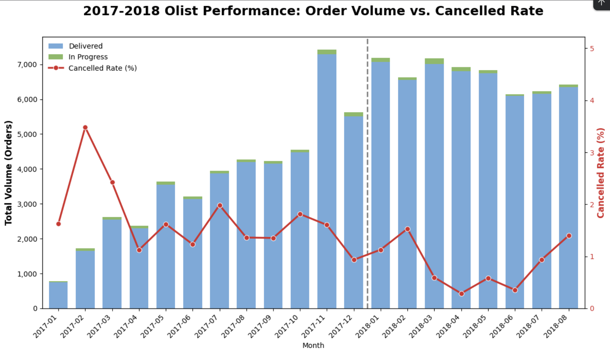
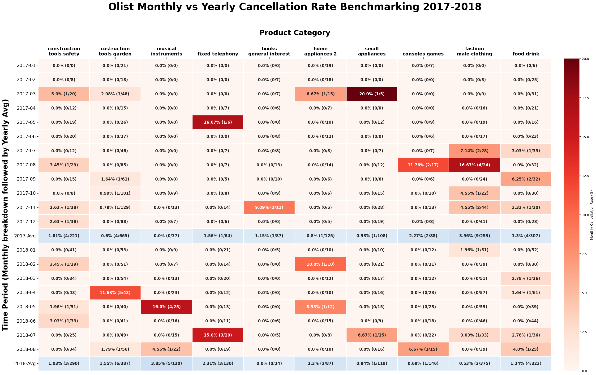

# Olist E-Commerce Operational Performance Analysis

## Project Overview & Core Philosophy
This repository serves as an evolving, end-to-end analytics project driven by Iterative Exploratory Data Analysis (EDA) within the Olist e-commerce ecosystem. Rather than delivering a static report, my approach centers on deep-dive data exploration—continually surface-mining the dataset to transform subtle anomalies into actionable business intelligence. I will be consistently expanding this repository with new investigative phases as further root-cause attribution unfolds.

---

## Phase 1: Platform-Wide Macro Trends & Cancellation Baseline
In the initial phase of this project, **[01_platform_order_trends_and_cancellation_baseline.ipynb](./01_platform_order_trends_and_cancellation_baseline.ipynb)**, I established a platform-wide macro baseline. By analyzing overall order fulfillment and timing trends, I determined that the platform's cancellation rate remained remarkably stable, consistently staying below 2% from May 2017 onward. 

### Platform-Wide Macro Cancellation Trend & Baseline (2017-2018)

Crucially, even during major sales events like the November Black Friday peak, the cancellation rate did not spike. This macroeconomic stability effectively ruled out systemic IT failures or platform-wide checkout crashes, directly motivating a more granular investigation into individual product categories to isolate specific operational vulnerabilities.

---

## Phase 2: Category-Specific Cancellation & Operational Attribution
*(Current Phase)*

In this second phase, **[02_category_cancellation_attribution.ipynb](./02_category_cancellation_attribution.ipynb)**, I shifted the analytical focus from platform-wide macro trends down to category-specific granular data to separate real operational threats from random statistical noise.

### Category Operational Performance: Monthly Matrix vs. Yearly Average

### Heatmap Matrix Interpretation & Key Takeaways
Each cell in this matrix displays the monthly cancellation rate for the respective category, calculated as the count of canceled and unavailable orders over total order volume. 

The dual-color encoding allows an analyst to instantly spot high-percentage anomalies via color density, while the overlaid volume metrics provide immediate context to determine if a spike is statistically significant or driven by low-volume noise. Through this cross-examination, I isolated the three primary targets introduced at the beginning of this report:

* **Construction Tools & Garden** (April 2018)
* **Telephony** (July 2018)
* **Fashion & Male Clothing** (August 2017)

---

## Pathway to Phase 3: Root-Cause Micro-Attribution
*(Upcoming Phase)*

By concluding Phase 2, I have successfully mapped exactly *where* and *when* these critical fulfillment failures occurred. However, aggregate percentages alone cannot explain the true underlying operational friction. 

To uncover the precise root causes behind the three isolated targets above, this repository will soon expand into **Phase 3**, transitioning from matrix processing into micro-level user and text analysis:

* **User Behavioral Analysis:** Profile buyer segments to detect potential cluster cancellations, payment gateway friction, or localized logistics bottlenecks during those specific high-risk months.
* **Review Sentiment Mining (NLP):** Extract and analyze customer feedback within `review_comment_message` to isolate high-frequency complaints regarding supplier stockouts, description mismatches, or unexpected delivery delays.
